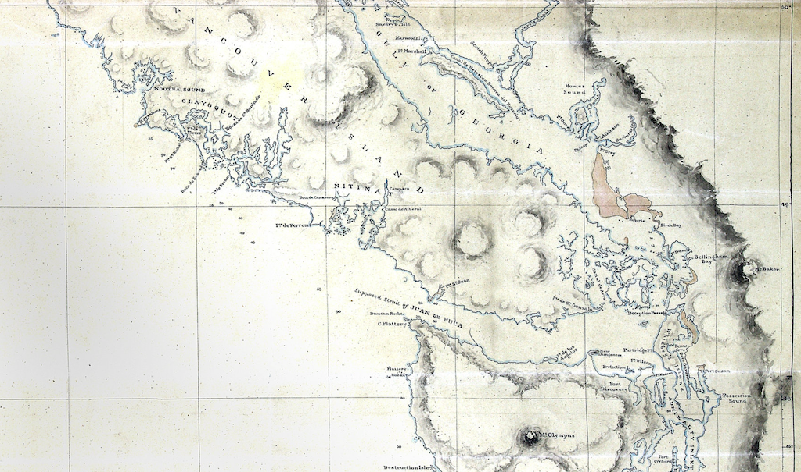

🔗 **Please link cautiously**. These sites have useful information about maps and naming, but this does not mean that I endorse or agree with the content presented, or that I have vetted every source for topics or content that may cause trauma to some readers.

#### Place name and map links

- [**BC Assembly of First Nations' "First Nations in BC" interactive map**](https://www.bcafn.ca/first-nations-bc/interactive-map) is a quick-loading, well-designed digital map with Territory, Treaty, and Nation information, as well as links to Nation websites.
- [**BC Geographical Names map**](https://apps.gov.bc.ca/pub/bcgnws/web/) represents the [BC Geographical Names Office](https://www2.gov.bc.ca/gov/content/governments/celebrating-british-columbia/historic-places/geographical-names)'s place-name database, or gazetteer, of all "officially" recognized place names.
- [**Native Land**](https://native-land.ca/) is [now working with the developers](https://www.whose.land/en/about) of the fantastic [Whose Land](https://www.whose.land/en/) app.
- [**Colonial Despatches map collection**](https://bcgenesis.uvic.ca/mapGallery.html) contains "200 maps of the B.C. area dating from the colonial period and before." Some of the historical maps and content presented on this site may contain racist and potentially traumatizing colonial terminology and language.
- [**Ditidaht Places**](http://ditidahtplaces.ca/map/) is a unique project "created for the purpose of education and reflects the learning of students at Ditidaht Community School." Using Open Street Maps, "[i]t builds on the efforts of Ditidaht Elders and Knowledge Holders who have shared and recorded their knowledge over many generations."
- [**First Nations of BC**](https://bcstudies.com/resources/first-nations-of-bc/first-nations-of-bc/) is a map by _BC Studies_ journal.
[**First Nation Profiles Interactive Map**](https://geo.aadnc-aandc.gc.ca/cippn-fnpim/index-eng.html), by Indigenous and Northern Affairs Canada, shows among other things "Indian Reserve or Indian Land" locations and boundaries.
- [**First Peoples' Map of BC**](https://maps.fpcc.ca/) by the First Peoples' Cultural Council. Highly recommended.
- [**Interactive Map**](http://nctr.ca/map.php) by the National Centre for Truth and Reconciliation shows "residential schools, events, and/or hearings" on a digital map of Canada.
- [**Musqueam Place Names Map**](http://old.musqueam.bc.ca/applications/map/index.html) is produced by the [Musqueam Indian Band](https://www.musqueam.bc.ca/) \[sic\].
- [**Stories from the Land: Indigenous Place Names in Canada**](https://maps.canada.ca/stories/storymap-en.html?lang=en&appid=acbd8457a3fa46df874351e1179ea237&appidalt=83e6463db5194c33be31f456f2cbd913) is a Government of Canada map-based project produced by a "special team" that "combed through thousands of possibilities in more than 70 different Indigenous languages from practically every corner of Canada to update the Indigenous Place Names Map with 125 new entries," as of 2022.
- [**David Rumsey Map Collection**](https://www.davidrumsey.com/home/the-collection) contains a wealth of historical maps, worldwide. Some of the maps and content presented on this site may contain racist and potentially traumatizing colonial terminology and language.
