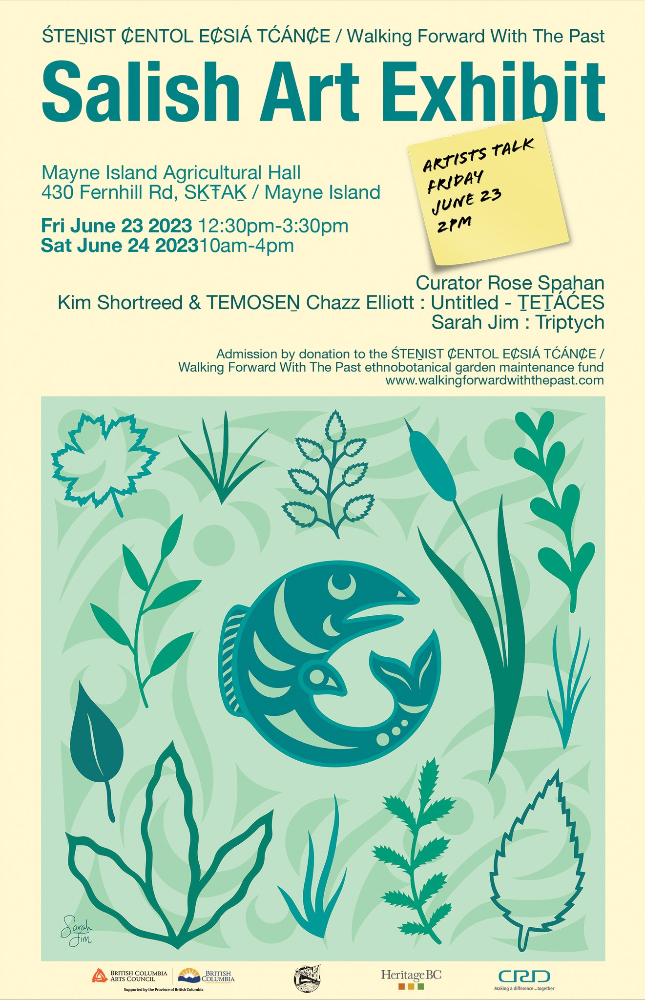
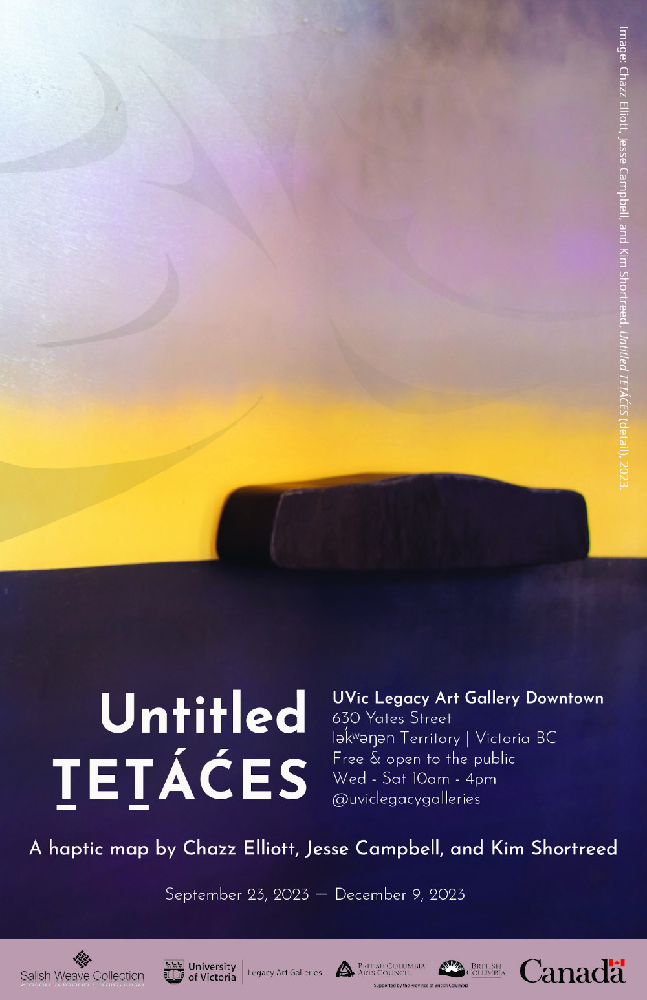

With thanks to all who helped put these shows together, the _Untitled ṮEṮÁĆES_ map has been on a wonderful journey...

### [Campbell Bay Music Fest](https://www.campbellbaymusicfest.com/visual-arts), June 23 - 24, 2023

This short but excellent show happened just prior to showing the _Untitled ṮEṮÁĆES_ map as part of [Kim's PhD defense](https://dspace.library.uvic.ca/items/ca4689bc-5f3f-42c3-9f61-e980c2eedf65). It gave us the chance to bring the map to another prominent place within WSÁNEĆ territory, S,ḴŦAḴ/Mayne Island. A big thanks to the Campbell Bay Music Fest organizers for creating [this great post](https://www.facebook.com/share/p/1BFGLYERrT/) about the show:

> JUST ANNOUNCED: an artists talk with the creators of Untitled ṮEṮÁĆES, 2pm Friday June 23rd at the Ag Hall! Come and learn about the installation in more depth.  
>   
> Untitled ṮEṮÁĆES is a contemporary interactive art installation. Calling into question ‘title’ to the islands, recent UVic PhD graduate Kim Shortreed and W̱SÁNEĆ artist TEMOSEN Chazz Elliott (WJOŁEŁP) collaborated to create this intriguing interactive art installation that allows us to explore, learn and react to the Indigenous names of the Islands and, at another level, asks us whose land is this?  
>   
> The exhibition is open 12:30-3:30pm on Fri June 23, and 10am-4pm on Sat June 24. Admission by donation to the ŚTEṈIST ȻENTOL EȻSIÁ TĆÁNȻE / Walking Forward With The Past ethnobotanical garden maintenance fund.  
>   
> “Untitled ṮEṮÁĆES” will be shown alongside a large-scale triptych created by artist Sarah Jim (TSEYCUM) whose work is inspired by the beauty of the lands and waters that the W̱SÁNEĆ people have stewarded since time immemorial.  
>   
> This exhibition will provide a unique opportunity for the public to immerse themselves in the rich heritage and captivating creativity of W̱SÁNEĆ art. Thoughtfully curated by Indigenous Curator Rose Spahan (W̱SÁNEĆ), this exhibition highlights the talents of a younger generation of Indigenous artists who are at the forefront of preserving and revitalizing their cultural traditions through art.

### [Legacy Art Gallery](https://maps.app.goo.gl/rbAGBHk2WWJBGPTh9), September 23 - December 9, 2023

Thanks to all who attended and to all who made this great show possible. We had a lively artists' [panel discussion](https://events.uvic.ca/legacy/event/79542-untitled-tetaces-artist-talk) with some excellent audience questions. Along with creating excellent resources, like the didactic panels for [exhibition's text](https://www.uvic.ca/legacygalleries/exhibitions/exh46-text.php), Legacy Galleries also took one aim of the show, to raise awareness about WSÁNEĆ place names, many steps further by working with us to create the **[_Untitled ṮEṮÁĆES_ Online Education Package](https://legacy.uvic.ca/gallery/untitledtetaces/)**. Designed to give K-12 students, teachers, this resource gives and community members an opportunity to further learn from and engage with the _Untitled ṮEṮÁĆES_ art exhibition in their classrooms and at home.

### [UVic McPherson Library](https://www.uvic.ca/library/about/events/news/current/tetaces-exhibit.php), January - July, 2024

Thanks to UVic Libraries, especially to Fine Arts Librarian [Christine Walde](https://www.uvic.ca/library/help/librarians/cwalde/index.php), for hosting the map for its longest show to date! Hundreds of students, staff, and other visitors to the library got to experience the map and learn more about it. 

<figure style="text-align:center;">
  
  <figcaption></figcaption>
</figure>

